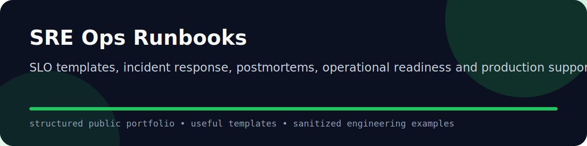

  
  
  

## Purpose

SLO templates, incident response, postmortems, operational readiness and production support patterns.

This repository is part of a public infrastructure leadership portfolio. It is designed to be useful, clean and easy to review.

## Contents

| Folder | Purpose |
|---|---|
| `docs/` | Standards, operating model and architecture notes. |
| `runbooks/` | Operational procedures and response templates. |
| `templates/` | Reusable patterns for teams. |
| `scripts/` | Small utilities and automation starters. |
| `.github/workflows/` | CI/CD and quality checks. |

## Operating model

## Reviewer guide

- Start with `docs/operating-model.md`.
- Review `templates/` for reusable patterns.
- Review `runbooks/` for operational maturity.
- Review `.github/workflows/quality.yml` for repository discipline.

## Public safety

No employer code, no credentials, no customer data, no private diagrams and no internal hostnames.
